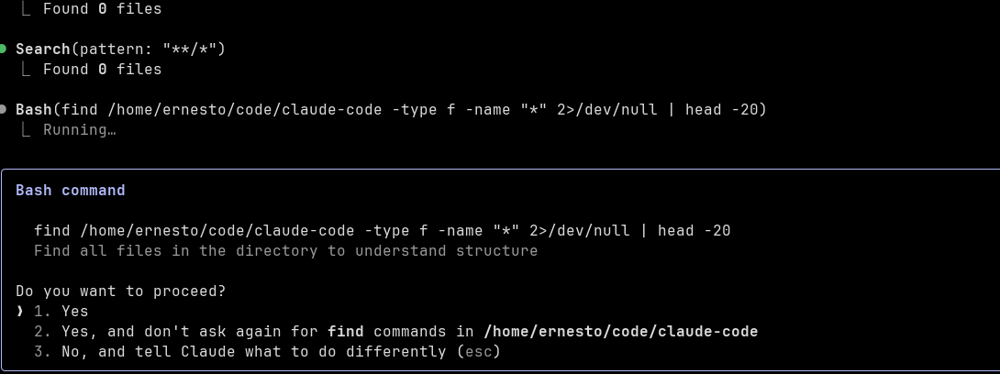

# Tutorial: Claude Code y Container Use

Tutorial para ejecutar Claude Code y uso de contenedores, para poder crear agentes en background que estén trabajando en una tarea específica en un contenedor.

- Setup Claude Code
- Crear proyecto API Go
- Uso de Claude Code 
- Instlacion de Container Use
- Ejemplo de tarea en background container

## Setup Claude Code

Claude es una herramienta que nos permite interactuar con un agente IA y tools, usando los modelos de Anthropic Claude (Sonnet 3.5, Sonnet 3.0) desde la terminal. De esta manera no dependemos de usar un editor específico (VSCode, Cursor, Windsurf) y podemos trabajar en un proyecto/repositorio de manera agnóstica (de todas maneras se puede conectar Claude Code a VSCode, Cursor en caso de que lo queramos).

### Requisitos Previos

Como primer paso necesitamos tener Node.js instalado en nuestra máquina y ejecutar este comando:

```bash
npm install -g @anthropic-ai/claude-code
```

### Configuración Inicial

Una vez instalado, tenemos que ejecutarlo dentro de la carpeta donde se encuentre el proyecto. Para esto vamos a crear una carpeta:

```bash
mkdir claude-code-example && cd claude-code-example
```

Ejecutamos Claude:

```bash
claude
```

Nos va a pedir permisos, presionamos en **Yes**.

### Opciones de Autenticación

Claude Code nos va a mostrar estas dos opciones:

1. **Suscripción en Claude**
2. **Anthropic Account Console**

En caso de tener una cuenta en Claude ya están listos. Si no, tienen que seleccionar la segunda opción, en la cual Claude se va a encargar de configurar un acceso ApiKey en nuestra cuenta.

### Configuración Manual de API Key (Opcional)

En caso de tener un ApiKey ya generado, existe la posibilidad de utilizarlo haciendo lo siguiente:

1. Ir a la siguiente carpeta:
   ```bash
   cd ~/.claude
   ```

2. Crear o modificar el archivo `settings.json` con lo siguiente:
   ```json
   {
     "apiKeyHelper": "~/.claude/anthropic_key.sh"
   }
   ```

3. Crear el script:
   ```bash
   nano anthropic_key.sh
   ```

4. Agregar la API Key:
   ```bash
   echo "sk-..."
   ```

Una vez configurado nuestro ApiKey o cuenta, podemos acceder a Claude.


### Crear proyecto API go.

Para probar claude-code en conjunto con container-use ,  vamos a crear un proyecto de una API en Go.
https://go.dev/

En la carpeta creada anteriormente, claude-code-example, agregamos estos dos archivos.

#### go.mod

```go
module goapi

go 1.23
```

#### main.go

```go
package main

import (
	"encoding/json"
	"net/http"
)

type Response struct {
	Message string `json:"message"`
}

func helloHandler(w http.ResponseWriter, r *http.Request) {
	response := Response{Message: "Hello World"}
	w.Header().Set("Content-Type", "application/json")
	json.NewEncoder(w).Encode(response)
}

func main() {
	http.HandleFunc("/hello", helloHandler)
	http.ListenAndServe(":8080", nil)
}
```

Ejecutar el servicio de esta manera:

```bash
go run main.go
```

Probamos que este todo Ok usando Curl via terminal:

```bash
curl http://localhost:8080/hello
```   

Inicializar git 
```bash
git init
git add .
git commit -m "Initial commit"
```


## Uso de Claude Code  

Antes de arrancar con el uso de claude code, debemos crear un archivo de configuracion CLAUDE.md para indicarles cuales son las instrucciones que debe seguir claude.

Dentro de claude, ejecutar lo siguiente.

```sh 
/init
```

Durante la ejecucion de este comando,  claude les va a pedir permiso para ejcutar herramientes.


Archivo generardo por claude 

https://github.com/ernesto27/tutorials/commit/975140d21d0f116a68dfea28c0e55feae95bdc57


Vamos a ver un ejemplo de como seria el uso de Claude code desde la terminal, realizando cambio en nuestro branch actual.

Vamos a pedir a claude que nos genere un endpoint que retorne la version actual de la API.

```bash
claude "Crea un endpoint que retorno la version actual de la API, la version se define en un archivo llamado version.json"
```


