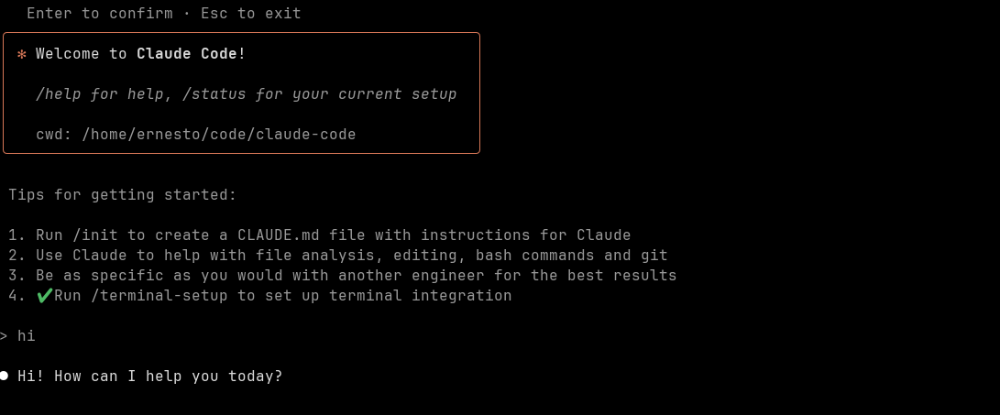

# Tutorial: Claude Code y Container Use

Tutorial para ejecutar Claude Code y uso de contenedores, para poder crear agentes en background que estén trabajando en una tarea específica en un contenedor.

- Setup Claude Code
- Crear proyecto API Go
- Uso de Claude Code 
- Instlacion de Container Use
- Ejemplo de tarea en background container

## Setup Claude Code

Claude es una herramienta que nos permite interactuar con un agente IA y tools, usando los modelos de Anthropic Claude (Sonnet 3.5, Sonnet 3.0) desde la terminal. De esta manera no dependemos de usar un editor específico (VSCode, Cursor, Windsurf) y podemos trabajar en un proyecto/repositorio de manera agnóstica (de todas maneras se puede conectar Claude Code a VSCode, Cursor en caso de que lo queramos).

### Requisitos Previos

Como primer paso necesitamos tener Node.js instalado en nuestra máquina y ejecutar este comando:

```bash
npm install -g @anthropic-ai/claude-code
```

### Configuración Inicial

Una vez instalado, tenemos que ejecutarlo dentro de la carpeta donde se encuentre el proyecto. Para esto vamos a crear una carpeta:

```bash
mkdir claude-code-example && cd claude-code-example
```

Ejecutamos Claude:

```bash
claude
```

Nos va a pedir permisos, presionamos en **Yes**.

### Opciones de Autenticación

Claude Code nos va a mostrar estas dos opciones:

1. **Suscripción en Claude**
2. **Anthropic Account Console**

En caso de tener una cuenta en Claude ya están listos. Si no, tienen que seleccionar la segunda opción, en la cual Claude se va a encargar de configurar un acceso ApiKey en nuestra cuenta.

### Configuración Manual de API Key (Opcional)

En caso de tener un ApiKey ya generado, existe la posibilidad de utilizarlo haciendo lo siguiente:

1. Ir a la siguiente carpeta:
   ```bash
   cd ~/.claude
   ```

2. Crear o modificar el archivo `settings.json` con lo siguiente:
   ```json
   {
     "apiKeyHelper": "~/.claude/anthropic_key.sh"
   }
   ```

3. Crear el script:
   ```bash
   nano anthropic_key.sh
   ```

4. Agregar la API Key:
   ```bash
   echo "sk-..."
   ```

Una vez configurado nuestro ApiKey o cuenta, podemos acceder a Claude.




### Crear proyecto API go.

Para probar claude-code en conjunto con container-use ,  vamos a crear un proyecto de una API en Go.
https://go.dev/

En la carpeta creada anteriormente, claude-code-example, agregamos estos dos archivos.

#### go.mod

```go
module goapi

go 1.23
```

#### main.go

```go
package main

import (
	"encoding/json"
	"net/http"
)

type Response struct {
	Message string `json:"message"`
}

func helloHandler(w http.ResponseWriter, r *http.Request) {
	response := Response{Message: "Hello World"}
	w.Header().Set("Content-Type", "application/json")
	json.NewEncoder(w).Encode(response)
}

func main() {
	http.HandleFunc("/hello", helloHandler)
	http.ListenAndServe(":8080", nil)
}
```

Ejecutar el servicio de esta manera:

```bash
go run main.go
```

Probamos que este todo Ok usando Curl via terminal:

```bash
curl http://localhost:8080/hello
```   

Inicializar git 
```bash
git init
git add .
git commit -m "Initial commit"
```


## Uso de Claude Code  

Antes de arrancar con el uso de claude code, debemos crear un archivo de configuracion CLAUDE.md para indicarles cuales son las instrucciones que debe seguir claude.

Dentro de claude, ejecutar lo siguiente.

```sh 
/init
```

Durante la ejecucion de este comando,  claude les va a pedir permiso para ejcutar herramientes.


Archivo generardo por claude 

https://github.com/ernesto27/tutorials/commit/975140d21d0f116a68dfea28c0e55feae95bdc57


Vamos a ver un ejemplo de como seria el uso de Claude code desde la terminal, realizando cambio en nuestro branch actual.

Vamos a pedir a claude que nos genere un endpoint que retorne la version actual de la API.

```bash
claude "Crea un endpoint que retorne la version  de la API, la version se define en un archivo llamado version.json"
```

A medida que se va generado el codigo, claude nos va mostrando los cambios que va realizando y la opcion de aceptar o modificar los cambios.

Cambios generados por claude:

https://github.com/ernesto27/tutorials/commit/5f80e12ea9aad4a51fece7a34de5db72c921ba4f


Este seria un flujo de uso basico de claude code, en donde vamos viendo los cambios de manera incremental y podemos aceptar o modificar los cambios que nos propone al momento,  lo cual seria algo similar a lo que se puede hacer con vsCode, Cursor o Windsurf pero desde la terminal.

En el proximo paso vamos a ver como podemos usar claude code para ejecutar tareas en background.


## Claude code con Container use.

Al momento si quiseramos usar claude code para ejecutar alguna otra tarea fuera de el branch o entorno local,  podriamos tener otra copia de proyecto en otra ruta y ejecutar claude ,  pero de que manera podriamos delegar una tarea a claude code sin que afecte a nuestro branch o carpeta acutal en la que necesitemos trabajar en otras tareas?

Para esto podemos utilizar contenedores,  el cual nos permite tener un entorno aislado para ejecutar tareas o probar ideas,  
vamos a utilizar un proyecto llamado container-use,  el cual esta desarrollado por el equipo creado de Docker y posteriormente de dagger.

https://github.com/dagger/container-use

### Instalación de Container Use

Ejecutar el siguiente comando 
```bash
curl -fsSL https://raw.githubusercontent.com/dagger/container-use/main/install.sh | bash
```

Una vez instalado cu,  tenemos que configurar claude para que utilice el servicio MCP de cu.

https://docs.anthropic.com/en/docs/mcp

en la carpete del proyecto ejecutamos el siguiente comando:

```bash
claude mcp add container-use -- cu stdio
```

Agregar reglas de container use a CLAUDE.md 

```bash
curl https://raw.githubusercontent.com/dagger/container-use/main/rules/agent.md >> CLAUDE.md
```

### Crear tarea en background con container use

Una vez configurado container-user vamos a probar lo siguiente:

- Crear tarea en background con container use, claude code 
- Revisar cambios realizados por claude code
- Merger los cambios al branch principal


Vamos a pedirle a claude que genere tests para los endpoints de nuestra API y ademas agregue una carpeta para los handlers/controladores de la API.

```bash
claude "Crea tests para los endpoints de la API y agrega una carpeta llamada controllers para los handlers de los endpoints,  usa container-use MCP"
```

Claude va a empezar una nueva sesion, con la diferencia de que esta vez va a utilizar el MCP cu (container-use) para ejecutar los cambios en un contenedor.
A medida que va ir avanzando, nos va a pedir permismo para ejecutar diferentes tools.


Selecciones la segunda opcion "Yes, and don't ask again for container-use:environment_create",  de esta menera en las proximas tareas ya no nos va a aparecer este mensaje.

Podemos ver cuales son los branchs creados por container user, con el siguient comando:

```bash 
cu list 

```
```bash 
ID                TITLE                           CREATED         UPDATED
devoted-squirrel  Go API Testing and Refactoring  5 minutes ago   11 seconds ago
```
Podemos ver los cambios realizados via terminal

```bash
cu logs 
```

A medida que se va generado el codigo, claude nos va mostrando los cambios que va realizando y la opcion de aceptar o modificar los cambios.

Cambios generados por claude:

https://github.com/ernesto27/tutorials/commit/5f80e12ea9aad4a51fece7a34de5db72c921ba4f


Este seria un flujo de uso basico de claude code, en donde vamos viendo los cambios de manera incremental y podemos aceptar o modificar los cambios que nos propone al momento,  lo cual seria algo similar a lo que se puede hacer con vsCode, Cursor o Windsurf pero desde la terminal.

En el proximo paso vamos a ver como podemos usar claude code para ejecutar tareas en background.


## Claude code con Container use.

Al momento si quiseramos usar claude code para ejecutar alguna otra tarea fuera de el branch o entorno local,  podriamos tener otra copia de proyecto en otra ruta y ejecutar claude ,  pero de que manera podriamos delegar una tarea a claude code sin que afecte a nuestro branch o carpeta acutal en la que necesitemos trabajar en otras tareas?

Para esto podemos utilizar contenedores,  el cual nos permite tener un entorno aislado para ejecutar tareas o probar ideas,  
vamos a utilizar un proyecto llamado container-use,  el cual esta desarrollado por el equipo creado de Docker y posteriormente de dagger.

https://github.com/dagger/container-use

### Instalación de Container Use

Ejecutar el siguiente comando 
```bash
curl -fsSL https://raw.githubusercontent.com/dagger/container-use/main/install.sh | bash
```

Una vez instalado cu,  tenemos que configurar claude para que utilice el servicio MCP de cu.

https://docs.anthropic.com/en/docs/mcp

en la carpete del proyecto ejecutamos el siguiente comando:

```bash
claude mcp add container-use -- cu stdio
```

Agregar reglas de container use a CLAUDE.md 

```bash
curl https://raw.githubusercontent.com/dagger/container-use/main/rules/agent.md >> CLAUDE.md
```

### Crear tarea en background con container use

Una vez configurado container-user vamos a probar lo siguiente:

- Crear tarea en background con container use, claude code 
- Revisar cambios realizados por claude code
- Merger los cambios al branch principal


Vamos a pedirle a claude que genere tests para los endpoints de nuestra API y ademas agregue una carpeta para los handlers/controladores de la API.

```bash
claude "Crea tests para los endpoints de la API y agrega una carpeta llamada controllers para los handlers de los endpoints,  use container-use MCP"
```

Claude va a empezar una nueva sesion, con la diferencia de que esta vez va a utilizar el MCP cu (container-use) para ejecutar los cambios en un contenedor.
A medida que va ir avanzando, nos va a pedir permismo para ejecutar diferentes tools.


Debido a que container-use genere un nuevo branch,  tambien podemos ver los cambios haciendo un checkout al branch correspondiente:


Y en caso de ser necesario, agregar los cambios correspondientes en este branch o tambien en todo caso pedirle a Claude que los realice.

Una vez que estamos conformes con los cambios podemos hacer un merge al branch principal,  de esta manera:

```bash
cu merge devoted-squirrel main
```


