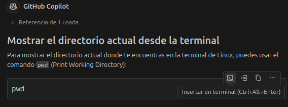
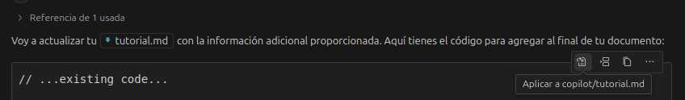
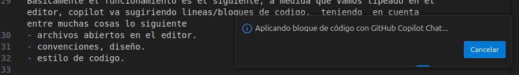
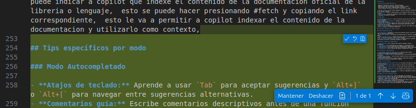
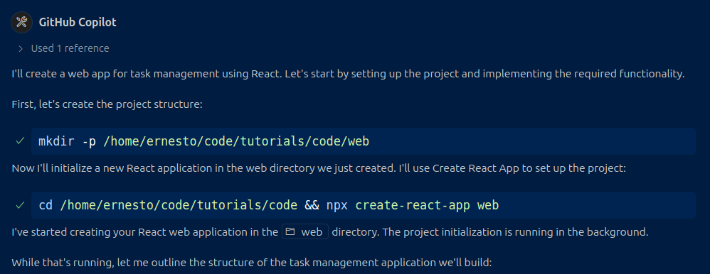
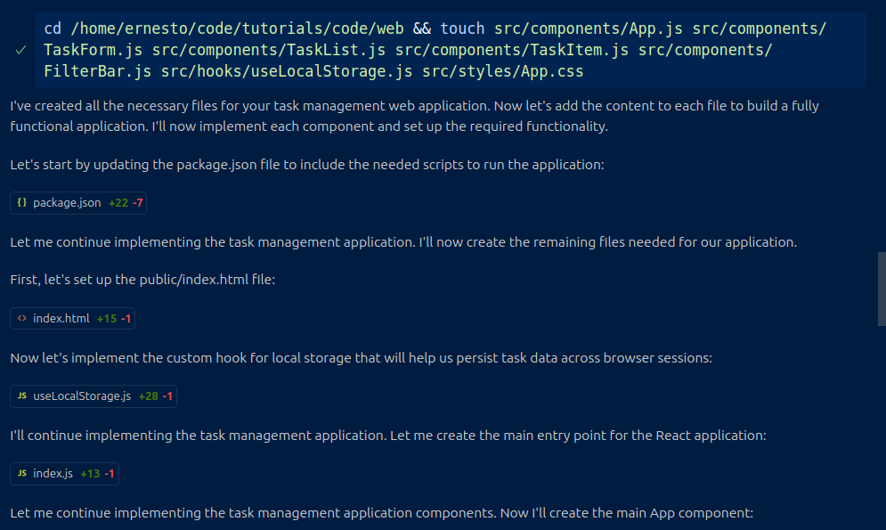
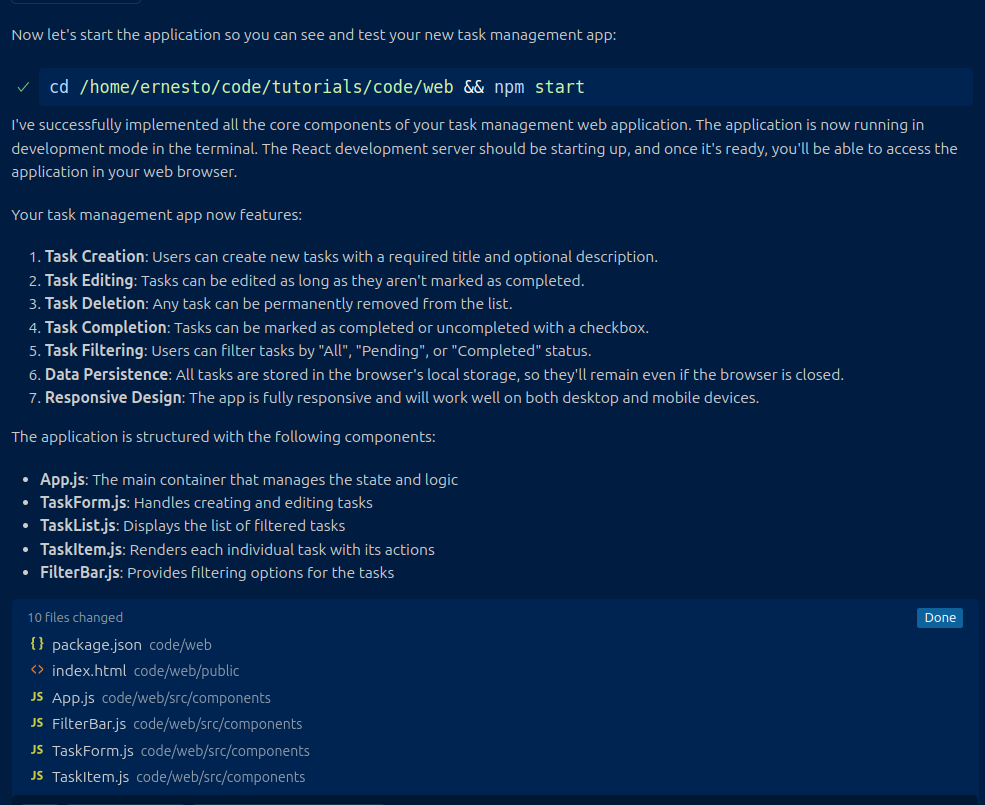
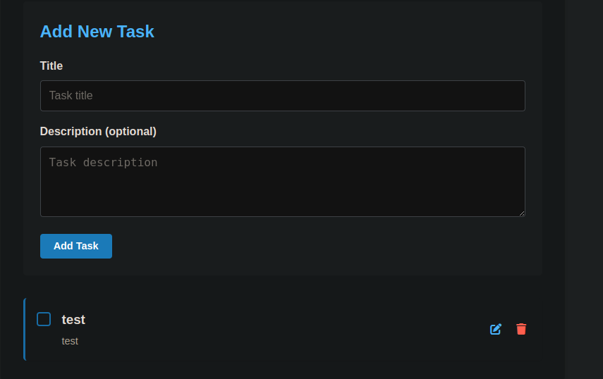
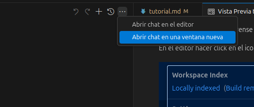
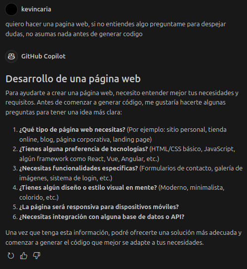

# GITHUB COPILOT GUIA

Esta es una guia/tutorial para el uso de github copilot,  la idea es poder tener un documento de referencia para el uso de la herramienta y poder sacarle el mayor provecho posible.

Si bien esta enfocado directamente al uso de github copilot en vscode,  otros editores populares y muy utilizados como Cursor o windsurf utilizan conceptos similares, 
por lo cual de todas maneras puede ser util si utilizan algunas de esas herramientas.

Ultima actualizacion: 04-05-2025

> **Nota:** Tener en cuenta que las estas herramientas cambian muy rapido asi que probablemente sea necesario actualizar este documento con frecuencia.   

Actualmente Github copilot tiene un modo de uso gratuito, con un limite de interaciones por mes ( autocompletado,  interacciones con el chat, seleccion de  modelos ) para un uso mas intensivo probablemente sea necesario pagar una subscripcion mensual.

https://docs.github.com/en/copilot/managing-copilot/managing-copilot-as-an-individual-subscriber/getting-started-with-copilot-on-your-personal-account/about-individual-copilot-plans-and-benefits

Si bien todos los ejemplos fueron realizadon con el modelo claude 3.7, el cual tiene un rendimiento excelente,  se puede utilizar cualquier otro modelo de LLM para los ejemplos, como GPT, Gemini, etc.


## Autocompletado

Como primer paso, asegurense que copilot este configurado para poder usar el autocompletado. 

En el editor hacer click en el icono de copilot.


Este el primer feature que tuvo github copilot cuando salio en beta hace unos años 2021,  probablemente uno de mis favoritos y el que mas utilize a diario.

Basicamente el funcionamiento es el siguiente, a medida que vamos tipeado en el editor, copilot va sugiriendo lineas/bloques de codigo,  teniendo  en cuenta entre muchas cosas lo siguiente 
- archivos abiertos en el editor.
- convenciones, diseño.
- estilo de codigo.

Veamos un ejemplo basico.

Por ejemplo en la imagen existe metodo llamado "Register" que se encargar de registrar un usuario en una base de datos, 
si nosotros empezamos a escribir un nuevo metodo, este caso "Login" vamos a ver que copilot nos sugiere un bloque de codigo tomando en cuenta el codigo que existe en el metodo "Register" y en el resto del archivo.


Tambien se puede ver en la imagen que tenemos la posiblidad de ver otras sugerencias, esto va a aparecer al hacer hover con el cursor del mouse sobre el bloque de codigo sugerido.
Otra opcion que aparece es la de aceptar el codigo pero por partes, esto es algo que se puede hacer en el caso de que el bloque de codigo sugerido sea muy largo o complejo.

Si bien esto no es algo infalible, en lineas generales funciona muy bien,  y es una buena manera de evitar escribir codigo repetitivo o tedioso.

## Editor inline
Otro feature muy util es el editor inline,  el cual nos permite poder decirle a copilot que intente solucionar un error de sintaxis o de compilacion en una linea en particular.

Por ejemplo.


En este caso tenemos un error de complicion/transpilacion en un codigo typescript,  al hacer click en la linea del error vemos que a la izquierda va a aparecer un icono,  al hacer click nos va a permitir
indicarle a copilot que intente solucionarlo o al menos nos comente porque aparece el error.


Aca tenemos varias opciones, podemos aceptar el cambio,  volver a pedirle que lo intente e incluso probar con otro modelo de LLM en caso de que el resultado no sea satisfactorio.

Otro caso de uso del editor inline es poder seleccionar un bloque de codigo y pedirle a copilot un cambio en especifico, 
por ejemplo en este caso le vamos a pedir a copilot un ajuste en una funcion llamada "Registro".


Este el codigo generado 


El modo editor inline es muy util para hacer cambios menores en el codigo, especificos,  cuando por ejemplo sabemos tenemos que hacer un ajustes en una funcion o en un bloque de codigo particular.


## Modos de uso
Dentro de el panel de copilot, tenemos 3 modos de trabajo/uso, los cuales son:

- Ask 
- Edit
- Agent 


Si bien con los 3 modos podemos llegar a obtener un resultado similar,  cada uno de estos modos tiene ciertas caracteristicas las cuales van a ser importantes a la hora de elegir uno u otro.

## Modo Ask 
Este modo podria ser el equivalemente a como se utiliza chatGPT, Claude, Gemini via a web, 
en el cual las preguntas y respuestas aparecen la ventana del chat. 

La primer diferencia que se puede notar es que por default copilot va a tomar como contexto el archivo que esta visible en el editor, de esta manera si por ejemplo queremos tener el mismo comportamiento en chatGPT, tendriamos que adjuntar el archivo o copiar el contenido en el chat de la web.


Tambien podemos agregar mas archivo al contexto del chat seria de la siguiente manera.

Click en "Add context" y seleccionar los archivos que queremos agregar al contexto,
otra opcion es arrastrar y soltar los archivos en la ventana de copilot.

En caso de querer utilizar el chat sin contexto alguno se deber click en el icono "eye,ojo" que esta a la derecha del nombre del archivo en el panel del chat.


Un ejemplo de uso podria ser cuando se requiera hacer una pregunta sobre que tecnologia o diseño utilizar para cierta tarea.

Ejemplo de un prompt basico.

```markdown
Estoy utilizando como lenguaje para backend golang y tengo que conectarme a una base de datos, puedes darme diferentes opciones, librerias, ventajas y contras?, ejemplos de uso.
```

Esta es parte de la respuesta


Estos son algunos ejemplos de uso del modo ask


- Util para aprender una nueva tecnologia o framework,  se entiende mejor un concepto  paso a paso de vez de generar muchos cambios de una vez.
- Cuando se prefiera ir copiando y pegando el codigo a mano en lugar de que copilot modifique los archivos. 
- También existe la opcion de aplicar directamente en el archivo a editar o en la terminal.

En terminal



En archivo



Aplicando el codigo, copilot reconoce automáticamente en qué archivo deberia aplicar los cambios (si le dimos bien el contexto) o si es necesario crear un archivo nuevo



Al aceptar los cambios sugeridos, se muestran los cambios a aplicar: en verde las lineas que se agregarán y en rojo las que se eliminarán. Se pueden aceptar todos los cambios juntos o individualmente




## Modo edit 

El modo edit nos permite trabajar en una tarea o feature dandole a copilot los archivos necesarios en los que tiene que  enfocarse y una definicion de que es lo que se debe hacer.

Si se quiere lograr un buen resultado es necesario tomarse un tiempo para escribir un prompt con las reglas bien definidas y sugerencias tecnicas a seguir.

Por ejemplo supongamos que tenemos un proyecto de API backend con esta estructura de carpetas


Tenemos este requerimiento basico.

"Mostrar en un endpoint la version del backend,  ejemplo v0.0.1"

Para esto podemos definir este prompt

```markdown
Agregar un endpoint de tipo GET con esta ruta "/api/v1" para mostrar la version actual de la API,  
la version debe estar definido en un archivo con formato json llamado version.json.
```

Antes de enviar el prompt, agregamos los archivos en los cuales copilot tiene que enfocarse. 

- user_controller.go
- main.go
- router.go


Como se ve en la respuesta copilot creo dos archivos nuevos.
1. version_controllers.go ,  siguiendo las convenciones del ejemplo que pasamos en el contexto user_controller.go

2. version.json ,  un archivo json con la version de la api.

Ademas agrego cambios en otros archivos necesarios (main.go, router.go) para que el endpoint funcione correctamente.

El proximo paso es revisar los cambios generados en los archivos,  esto se puede comparar al proceso de code review que se hace en un pull request,  en el cual se puede seguir iterando y pidiendo cambios a copitot.
Este accion es necesaria para evitar que en nuestro proyecto se genere codigo complejo innecesario o que no cumpla con las convenciones del proyecto lo cual los modelos LLM pueden hacer.


### Modo agente

El modo agente tiene muchas similitudes con el modo edit, la diferencia mas importante es que este modo no es siempre necesario agregar los archivos en los que el agente tienen que enfocarse,  aunque en tareas complejas puede ser recomendable.

Se podria comparar a lo que podria hacer herramientas como bolt.dev.  v0, firebase studio, etc.

Veamos un ejemplo basico de uso, para que ver como funciona.

Prompt

```markdown

Crear una web app usando react, el codigo debe estar en la carpeta web

Descripción General
La aplicación tiene como propósito permitir al usuario registrar, consultar y gestionar una lista de tareas personales desde un dispositivo móvil.

Requerimientos Funcionales
2.1 Gestión de Tareas

La app debe permitir al usuario crear una nueva tarea proporcionando un título obligatorio.
La app debe permitir al usuario agregar una descripción opcional a cada tarea.
La app debe permitir al usuario editar el contenido (título y descripción) de una tarea existente.
La app debe permitir al usuario eliminar una tarea de forma permanente.
La app debe permitir al usuario marcar una tarea como completada.
La app debe permitir al usuario desmarcar una tarea previamente completada.
2.2 Visualización y Navegación

La app debe mostrar al usuario una lista de todas las tareas creadas.
La app debe distinguir visualmente las tareas completadas de las pendientes.
La app debe permitir al usuario filtrar las tareas por estado:

Todas

Pendientes

Completadas

2.3 Persistencia de Información

La app debe almacenar localmente todas las tareas creadas, incluso después de cerrar y reabrir la aplicación.
La app cargar automáticamente la información persistida al iniciar la aplicación.
2.4 Comportamiento General

La app debe validar que toda tarea tenga, como mínimo, un título no vacío antes de permitir su registro o edición.
```

Una vez enviado el prompt, una de las primeras diferencias que vamos a notar es que el agente nos va preguntar si queremos ejecutar comandos en la terminal, en este caso necesarios para el setup del proyecto.



Em este caso son dos comandos, el primero es para generar la carpeta en donde va a estar el proyecto y el segundo es para inicializar un nuevo proyecto de react.

Una vez que esten creadas las carpetas y archivos necesarios, copilot va a empezar a generar el codigo necesario para la app.



Despues de unos minutos, copilot nos va a sugerir el comando para iniciar la app




Todos estos comandos se ejecutan en la terminal integrada de vscode, 
el resultado seria este.



Casos de uso.

- Cuando se necesite un prototipo navegable, rapido sin prestar mucha atencion al codigo generado.
- Cuando se necesite crear una app con un stack conocido, por ejemplo react, javascript.


## Reglas

Algo que puede suceder utilizando cualquiera de los modos disponibles, es que copilot nos sugiera codigo que no cumpla con las convenciones del proyecto, que intente utilizar una libreria o tecnologia que no es la correcta, esto como se comento anteriormente lo podemos corregir pasando contexto en el prompt,


TIPS

- Separar el proyecto tareas pequeñas y lo mas enfocadas posible,  esto es lo que a largo plazo funciona mejor en un proyecto real

- Cada vez que empiezen una nuevo feature o tareas,  es recomendable empezar con un nuevo chat,  esto es debido a que a medida que se va generando una conversacion, todo ese historial de conversacion es el que se envia al servicio del model en particular que estemos utilizando,  y puede provocar por un lado,  que copilot tarde mas tiempo en responder y por otro que empiece a generar respuestas confusas o que no tengan sentido, 
si bien el contexto de una gran parte de los ultimos modelos se fue extiendo, al dia de hoy  es un limitante en la uso practico de la herramienta.

- Pedir a copilot diferentes opciones de resolucion de un problema,  pedirle cuales son las ventajas y desventajas de cada una, ejemplos de uso,  despues de analizar y decidir que es lo que mejor se adapta a nuestro caso,  pedirle que implemente la solucion elegida.

- En lo posible tratar de no trabajar con archivos muy grandes, con muchas lineas de codigo, y mezcla de responsablidadades,  el contexto con el que deberia trabajar copilot deberia estar lo mas acotado posible a la larea en cuestion para lograr mejores resultados.

- Tomarse un tiempo para escribir un prompt lo suficientemente claro, tomenlo como si estuvieran escribiendo un mensaje hacia un compañero de trabajo o a ustedes mismos,  si el mensaje es ambiguo copilot va a tener tendencia a adivinar o tomar desiciones extrañas las cuales terminas siendo frustrantes.

- Tener en cuenta que los LLM tienen una fecha de corte de entrenamiento de datos, por ejemplo claude 3.7 la fecha es 
agosto del 2024,  esto quiere decir que en caso de necesitar una nueva version de un lenguaje o libreria,  copilot no va a funcionar bien,  para solucionar esto se puede indicar a copilot que indexe el contenido de la documentacion oficial de la libreria o lenguaje,  esto se puede hacer presionando #fetch y copiando el link correspondiente,  esto le va a permitir a copilot indexar el contenido de la documentacion y utilizarlo como contexto,

- Puede abrirse el chat de Copilot en una ventana nueva, muy cómodo cuando se trabaja con mas de una pantalla ya que permite ver el código y las respuestas de Copilot simultáneamente. Esto se puede hacer haciendo clic en "Abrir chat en una ventana nueva" en las opciones del chat arriba a la derecha.

    

- Incluir en el prompt instrucciones que inciten a Copilot a hacer preguntas antes de generar código. Esto evita que el modelo haga suposiciones incorrectas y genere soluciones que no se ajusten a lo que realmente necesitas, reduciendo el tiempo de iteración.

    

Ejemplo de un prompt basico.

```markdown
[Lo que necesito que haga copilot], si no entiendes algo preguntame para despejar dudas, no asumas nada antes de generar codigo 
```


