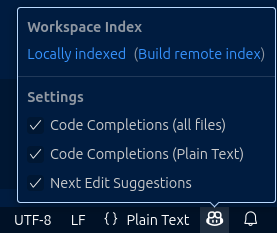

Tener en cuenta que en general se van agregando nuevas funcionalidades a la herramienta, por lo que es recomendable revisar la documentacion oficial de copilot para estar al tanto de las novedades.   

Este es un conjunto de tips/tutoriales para el uso de copilot.

Modelo.

1. Autocompletado

Como primer paso, asegurense que copilot este configurado para poder usar el autocomplete. 
En el editor hacer click en el icono de copilot.

Este el primer feature que tuvo github copilto cuando salio en beta en 2021,  probablemente uno de mis favoritos y el que mas utilize a diario.

Basicamente, a medida que vamos tipeado en el editor, copilot va sugiriendo lineas de codigo,  teniedo en cuenta los archivos 
que estan abiertos en el editor, preferencias de convenciones y teniendo en cuenta el estilo de codigo que el proyecto tiene.
como todo no es algo infalible y a veces no sugiere lo que uno espera, pero en general esta bastante cerca de lo que uno 
espera en general.

Por ejemplo en este ejemplo,  nosotros tenemos un metodo llamado "Register" que se encargar de registrar un usuario en una base de datos,
si nosotros empezamos a escribir un nuevo metodo, este caso login vamos a ver que copilot nos sugiere un bloque de codigo tomando en cuenta 
las practicas y convenciones que tiene el proyecto, como vemos en la imagen.

Tambien se puede ver en la imagen que tenemos la posiblidad de ver otras sugerencias, esto va a aparecer al hacer hover con el cursor del mouse sobre el bloque de codigo sugerido y en caso de querer ir mas paso a paso, poder ir aceptando las sugerencias de a poco ( esto pude ser util si copilot sugiere un codigo muy largo y demasiado complejo, o si no queremos aceptar todo de una vez).

2. Editor inline
Otro feature muy util es el editor inline,  el cual nos permite poder decirle a copilot que intente soluciar un error de sintaxis o de compilacion en una linea en particuular.

Por ejemplo veamos este ejemplo.

En este caso tenemos un error de complicion/transpilacion en typescript,  al hacer click en esea linea, a la izquierda va a aparecer un icono, el cual al hacer click nos va a permitir
indicarle a copilot que intente solucionarlo o al menos nos comente porque aparece el error.

Aca tenemos varias opciones, podemos aceptar el cambio,  volver a pedirle que lo itente,  probar con otro modelo de LLM en caso de no encontrar una solucion, etc.

Otro caso de uso del editor inline es poder seleccinar un bloque de codigo y pedirle a copilot un cambio en especifico, 
por ejemplo en este caso le vamos a pedir a copilot un ajuste en una funcion de Registro.

Este el codigo generado 

Dentro de el panel de copilot, tenemos 3 modos de trabajo, los cuales son:
Ask 
Edit
Agent 

Si bien con los 3 modos podemos llegar a obtener un resultado similar,  cada uno de estos modos tiene ciertas caracteristicas las cuales van a ser importantes a la hora de elegir uno u otro.

2. Modo Ask 
Este modo podria ser el equivalemente a como se utiliza chatGPT, Claude, Gemini via a web, 
en el cual las preguntas y respuestas aparecen la ventana del chat. 

La primer diferencia que se puede notar es que por default copilot va a tomar como contexto el archivo que esta visible en el editor, si queremos tener el mismo comportamiento en chatGPT, tendriamos que adjuntar el archivo o copiar el contenido en el chat.

Tambien podemos agregar mas archivo al contenxto del chat, de esta manera.

Click en "Add context" y seleccionar los archivos que queremos agregar al contexto,
otra opcion es arrastrar y soltar los archivos en la ventana de copilot.

En caso de querer utilizar el chat sin contexto alguno se deber click en el icono "eye,vista" que esta a la derecha del nombre del archivo en el panel del chat.

Casos de uso.

- Cuando se requiera hacer una pregunta sobre que tecnologia o diseño utilizar para cierta tarea.

Ejemplo basico de prompt.

Estoy utilizando como lenguaje para backend golang y tengo que conectarme a una base de datos,  puedes darme diferentes opciones, librerias,  ventajas y contras? ,  ejemplos de uso.

Respuesta

- Cuando se prefiera ir copiando y pegando el codigo a mano en lugar de que copilot modifique los archivos.
- Util para aprender una nueva tecnologia o framework,  se entiende mejor un concepto llendo a paso a paso de vez de generar muchos archivos.

3. Modo edit 

El modo edit nos permite trabajar en una tarea o feature dandole a copilot los archivos necesarios en los que deberia enfocarse, 
y una definicion detallada de que es lo que debe hacer.
Si se quiere lograr un buen resultado es necesario tomarse un tiempo para escribir un prompt con las reglas bien definidas y sugerencias tecnicas a seguir.

Por ejemplo supongamos que tenemos un proyecto de API backend con esta estructura de carpetas

Y tenemos definido este requermiento.

"Mostrar en un endpoint la version del backend,  ejemplo v0.0.1"

Para esto podemos definir este prompt

Agregar un endpoint de tipo GET con esta ruta "/api/v1" para mostrar la version actual de la API,  
la version debe estar definido en un archivo con formato json llamado version.json.

Como se ve en la respuesta, en el modo edit copilot creo dos archivos nuevos.
1. version_controllers.go ,  siguiendo las convenciones del ejemplo que pasamos en el contexto user_controller.go

2. version.json ,  un archivo json con la version de la api.

Ademas agrego cambios en otros archivos necesarios (main.go, router.go) para que el endpoint funcione correctamente.

El proximo paso es revisar los cambios generados en los archivos,  esto se puede comparar al proceso de code review que se hace en un pull request,  en el cual se puede seguir iterando y pidiendo cambios a copitot.
Este accion es necesaria para evitar que en nuestro proyecto se genere codigo complejo innecesario o que no cumpla con las convenciones del proyecto lo cual los modelos LLM suelen hacer.

4. Modo agente

5. Modo reglas.

TIPS

- Separar el proyecto tareas pequeñas y lo mas enfocadas posible,  esto es lo que a largo plazo funciona mejor en un proyecto real

- Cada vez que empiezen una nuevo feature o tareas,  es recomendable empezar con un nuevo chat,  esto es debido a que a medida que se va generando una conversacion, todo ese historial de conversacion es el que se envia al servicio del model en particular que estemos utilizando,  y puede provocar por un lado,  que copilot tarde mas tiempo en responder y por otro que empiece a generar respuestas confusas o que no tengan sentido, 
si bien el contexto de una gran parte de los ultimos modelos se fue extiendo, al dia de hoy  es un limitante en la uso practico de la herramienta.

- Pedir a copilot diferentes opciones de resolucion de un problema,  pedirle cuales son las ventajas y desventajas de cada una, ejemplos de uso,  despues de analizar y decidir que es lo que mejor se adapta a nuestro caso,  pedirle que implemente la solucion elegida.

- En lo posible tratar de no trabajar con archivos muy grandes, con muchas lineas de codigo, y mezcla de responsablidadades,  el contexto con el que deberia trabajar copilot deberia estar lo mas acotado posible a la larea en cuestion para lograr mejores resultados.

- Tomarse un tiempo para escribir un prompt lo suficientemente claro, tomenlo como si estuvieran escribiendo un mensaje hacia un compañero de trabajo o a ustedes mismos,  si el mensaje es ambiguo copilot va a tener tendencia a adivinar o tomar desiciones extrañas las cuales terminas siendo frustrantes.

- Tener en cuenta que los LLM tienen una fecha de corte de entrenamiento de datos, por ejemplo claude 3.7 la fecha es 
agosto del 2024,  esto quiere decir que en caso de necesitar una nueva version de un lenguaje o libreria,  copilot no va a funcionar bien,  para solucionar esto se puede indicar a copilot que indexe el contenido de la documentacion oficial de la libreria o lenguaje,  esto se puede hacer presionando #fetch y copiando el link correspondiente,  esto le va a permitir a copilot indexar el contenido de la documentacion y utilizarlo como contexto,